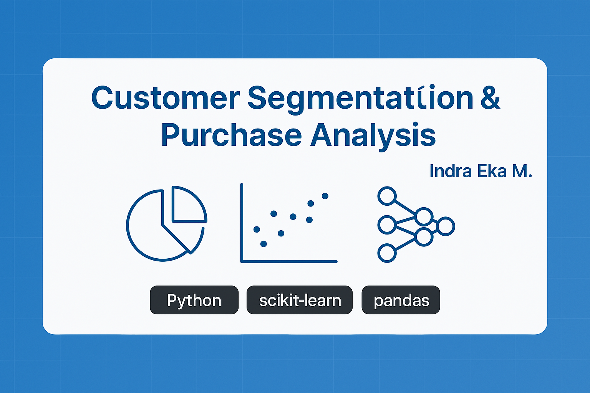

# 🛍️ Customer Segmentation & Purchase Behavior Analysis



This project analyzes **customer purchase behavior** from retail transaction data and performs **segmentation** based on age, gender, spending habits, and item categories.  
The project uses **data visualization and clustering** techniques for extracting patterns and insights from customer demographics and purchase patterns.

---


---

## 🎯 Objective

- Understand customer distribution by age, gender, and purchase category
- Analyze product popularity and spending patterns
- Prepare feature sets for clustering & segmentation

---

## 🔍 Key Steps

- Data Cleaning: remove duplicates, handle missing values
- Feature Engineering: total price, age range labels, date decomposition
- Visualizations:
  - Age group vs. spending
  - Product categories purchased vs. average sales
  - Yearly sales trend by product category
- Clustering & Silhouette/Davies-Bouldin scoring

---

## 📂 Project Files

```
CustomerSegmentation_TA2/
├── CustomerSegmentation.ipynb
├── assets/
│   └── customer-segmentation-banner.png
└── data/
    └── customer_transactions.csv
```

---

## 🚀 How to Run

1. Open `CustomerSegmentation.ipynb` in Google Colab
2. Upload the dataset or mount Google Drive
3. Run the analysis cells step-by-step to generate insights

---

## 👨‍💻 Author

**Indra Eka Mandriana S.Kom**  
_Data Analytics & Customer Insight Specialist_

---

## ⭐ Like what you see? Give it a ⭐
